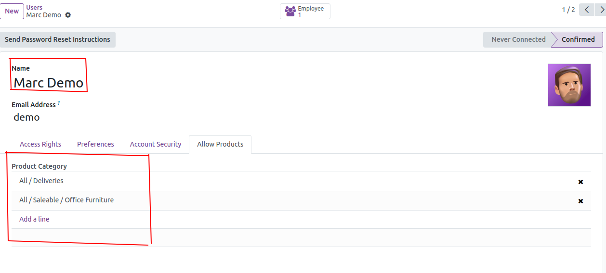
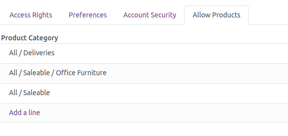
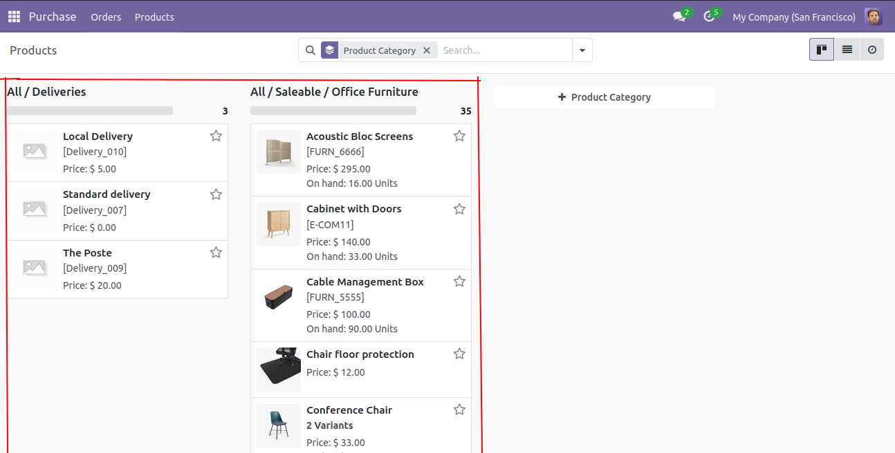

========================================================
Product Category Restriction Module for Odoo
========================================================

Welcome to the documentation for the **Product Category Restriction** module for Odoo. This module allows administrators to restrict user access to products based on their category and sub-category, while supporting Odoo’s multi-company functionality.

Contents
========

- `Overview <#overview>`_
- `Features <#features>`_
- `Installation <#installation>`_
- `Usage <#usage>`_
- `Screenshots <#screenshots>`_
- `Support <#support>`_

Overview
========

The **Product Category Restriction** module provides a streamlined way to manage product visibility across your Odoo platform. By restricting access to products based on their categories and sub-categories, you can ensure that users only see the products that are relevant to them. This module is particularly useful for businesses operating in a multi-company environment where product visibility needs to be controlled across different subsidiaries.

Features
========

- **Category-Based Restrictions**: Restrict product visibility based on product categories and their sub-categories.
- **Multi-Company Support**: Ensures that restrictions are applied across different companies within your Odoo instance.
- **Customizable Access Rules**: Easily configure who can see which products using user roles.
- **User-Friendly Interface**: Simple and intuitive configuration through the Odoo backend.

Installation
============

To install the **Product Category Restriction** module, follow these steps:

1. **Download** the module from the repository or marketplace.
2. **Copy** the module to your Odoo add-ons directory.
3. **Update the Apps List** in Odoo by navigating to the Apps menu and clicking 'Update Apps List'.
4. **Install** the module by searching for "Product Category Restriction" in the Apps menu and clicking 'Install'.

Ensure that your Odoo server is restarted after copying the module to the add-ons directory.

Usage
=====

After installing the **Product Category Restriction** module:

1. Navigate to the **Products** section in the Odoo backend.
2. Select a product and edit its details.
3. Under the **Access Control** tab, specify the categories and sub-categories for which the product visibility is restricted.
4. Define the user roles that are allowed to view these products.
5. Save your changes and the restrictions will be applied accordingly.

Screenshots
===========

Below are some screenshots demonstrating the functionality of the module:

Support
=======

For further assistance or to report issues, please contact us:

- **Email**: `shahanand1072004@gmail.com <mailto:shahanand1072004@gmail.com>`_

You can also contribute to the module by submitting issues and pull requests on our `GitHub repository <https://github.com/ShahAnand10/restrict_product_user>`_.

We appreciate your feedback and suggestions!

License
=======

This module is licensed under the GNU Affero General Public License (AGPL-3.0). For more information, see the `LICENSE <LICENSE>`_ file.

Thank you for using our module!
